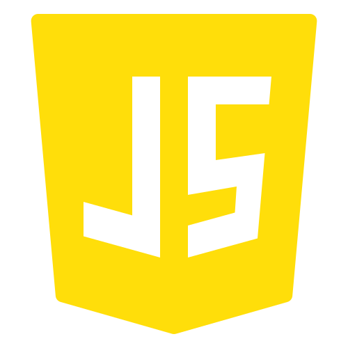

### Ahoy, I'm Ghouse - aka [GhouseK1][website]

## Backend Engineer, CS Grad

- :computer: I’m currently working on [Personal projects (public & private)][gitprojects]
- :blue_book: I’m currently focusing on improving the performance & scalability of backend apps
- :bulb: I’m looking to collaborate with other devs
- :dart: 2023 Goals: Contribute more to Open source projects & Build personal projects
- ⚡ Fun fact: I love to cook and play video games

### Connect with me:

 
[][website]
[][email] 
[][linkedin] 
[][twitter]
[][devto]

 
 

### Skills

<table>
<tr>
<td width="50%">
<h3 align="left">Languages: </h3>

 
 

</td>
<td width="50%">
<h3 align="left">Backend: </h3>

</td>
</tr> 
<tr>
<td width="50%">
<h3 align="left">Frontend: </h3>

 
 
 
 

</td>
<td width="50%">
<h3 align="left">Database:</h3>

 
 

</td>
</tr>  
<tr>
<td width="50%">
<h3 align="left">Frontend: </h3>

 
 
 
 

</td>
<td width="50%">
<h3 align="left">Database:</h3>

 
 
 
 

</td>
</tr>                                                               
</table> 

### Open-source contributions

<table>
<tr>
<td width="33%">
<h3 align="left">meilisearch-java</h3>

 Code contributions in meilisearch 

</td>

</tr>                                                                
</table> 

 
 

### Featured Personal Projects

<table>
<tr>
<td width="33%">
<h3 align="left">Secundus Brain</h3>

<strong>App that acts as your second brain</strong>

Java,React, Kafka, Meilisearch

</td>

<td width="33%">                                                                                     
<h3 align="left">Social raven</h3>

 
 

<strong>Social media analytics & management tool</strong> 

Java,React Kafka

</td>
</tr>                                                                
</table>   

 
 

### Github Stats

 

  

   
   [][github]
   
  

 
 

[email]: mailto:ghousek1@outlook.com
[website]: https://ghousek1.com
[linkedin]: https://linkedin.com/in/ghousek1
[twitter]: https://twitter.com/ghousek1ofcl
[reddit]: https://reddit.com/u/ghousek1
[devto]: https://dev.to/ghousek1
[github]: https://github.com/ghousek1?tab=repositories
[gitprojects]: https://github.com/ghousek1?tab=repositories
[meilisearch]: https://github.com/meilisearch/meilisearch-java
[secundusbrain]: https://github.com/ghousek1/secundusbrain
[socialraven]: https://github.com/ghousek1/socialraven
                                                                              

                                                                                    